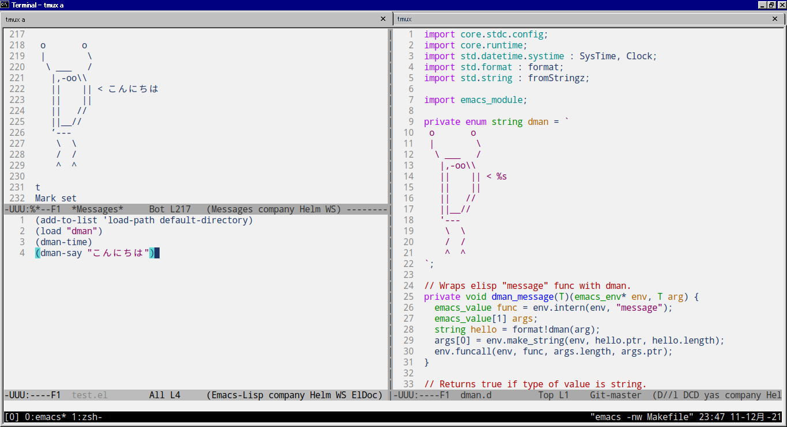

## tl;dr

Emacs lispからD言語で書いたD言語くんを召喚した

https://github.com/ShigekiKarita/emacs-dman



## Emacs dynamic module とは

C言語で書いたプラグイン（共有ライブラリ）をEmacs lispから呼ぶためのモジュール。C言語からもEmacs lispの関数を呼べたり便利。

> ダイナミックEmacsモジュール(dynamic Emacs module: 動的Emacsモジュール)とは、Emacs Lispで記述されたパッケージのように、Emacs Lispプログラムで使用するための追加機能を提供する共有ライブラリーです

マニュアル: https://ayatakesi.github.io/lispref/26.2/html/Dynamic-Modules.html


## D言語でC言語の共有ライブラリを書く

C言語用のライブラリを書く話はこの辺にまとまっている（雑）

* https://dlang.org/spec/interfaceToC.html
* https://dlang.org/articles/dll-linux.html

ちなみにEmacsが提供する emacs-module.h というファイルは [dpp](https://github.com/atilaneves/dpp) に変換してもらいました。まだ ImportC では読めなかった。

全体としては100行もないコードなので読んでほしい。おおまかにはこんな感じでD言語くんが時間を教えてくれる `dman_time` というネイティブ関数を、 `emacs_module_init` で `dman-time` という名前で登録:

```d
import emacs_module;

extern (C):

int plugin_is_GPL_compatible;

emacs_value dman_time(
    emacs_env* env, ptrdiff_t nargs, emacs_value* args, void* data);

int emacs_module_init(emacs_runtime* ert) {
  // Initialize D runtime.
  Runtime.initialize();

  // Register functions.
  emacs_value[2] fn_sym_pair;
  fn_sym_pair[0] = env.intern(env, "dman-time");
  fn_sym_pair[1] = env.make_function(
      env, /*min_arity=*/0, /*max_arity=*/0,
      /*function=*/&dman_time,
      /*documentation=*/"Dman tells you current time.",
      /*data=*/null);
  env.funcall(env, env.intern(env, "defalias"),
              fn_sym_pair.length, fn_sym_pair.ptr);
}
```

そして共有ライブラリをコンパイル:
```
dmd -shared dman.d -of=dman.so
```

すると Emacs の scratch とか適当な場所で elisp を書いて

```elisp
(add-to-list 'load-path "path-to-dir-of-dman.so")
(load "dman")
(dman-time)
```

`eval-buffer` とかで評価すると、Message バッファにD言語くんが召喚されて時間を教えてくれます

```bash
 o       o
 |        \
  \ ___   /
   |,-oo\\
   ||    || < 2021-Dec-12 00:03:23.4890837
   ||    ||
   ||   //
   ||__//
   ’---
    \  \
    /  /
    ^  ^
```

## 今後

ネタというかHello world的な感じでやってみたら簡単にできた。実用的な段階としては、D言語で書いたコード解析ツールなどをプロセス起動・通信などのオーバーヘッド無しでサクッと呼んでEmacsでのD言語の編集を快適にしたい。あとEmacs lispは好きだけど、D言語で全部書きたい。

具体的には先日D言語のimport文を辞書順にソートするツールを作ったので組み込んでみたい。 https://github.com/ShigekiKarita/d-import-sort

## お知らせ

Emacs lispをD言語が置き換える日まで [serve-d](https://github.com/Pure-D/serve-d) を使おう。簡単な設定ガイドを書きました。

https://github.com/Pure-D/serve-d/blob/master/editor-emacs.md
